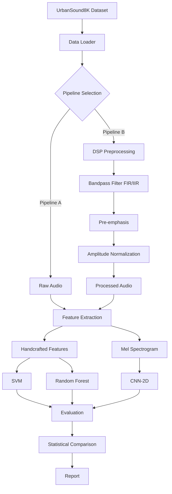
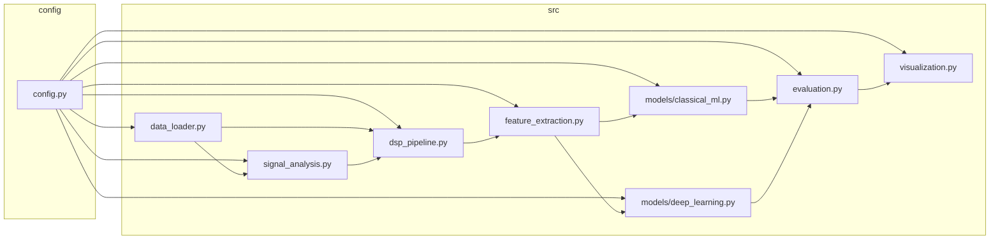

# Architecture — DSP501 Environmental Sound Classification

> Version: 1.0 | Last updated: 2026-03-13

## System Design

## Component Diagram

## Data Flow

1. **Loading**: UrbanSound8K CSV metadata → audio file paths → librosa load → resample to 22050 Hz → pad/truncate to 88200 samples
2. **Pipeline A**: Raw audio → extract features directly
3. **Pipeline B**: Raw audio → FIR bandpass (50-10000 Hz) → pre-emphasis (α=0.97) → peak normalize → extract features
4. **Features → ML**: Handcrafted feature vectors → StandardScaler → SVM/RF
5. **Features → DL**: Mel spectrograms (128 bands) → normalize → CNN-2D
6. **Evaluation**: 10-fold CV (predefined folds) → per-fold metrics → aggregate with 95% CI → paired t-test

## Key Decisions

| Decision | Rationale |
|----------|-----------|
| FIR over IIR as primary | Linear phase preserves temporal structure |
| 22050 Hz sample rate | Standard for audio ML; Nyquist covers 0-11025 Hz |
| 50-10000 Hz passband | Removes DC offset + high-freq noise, preserves all class-relevant bands |
| 40 MFCCs | More coefficients capture finer spectral detail for 10-class problem |
| PyTorch over TF | Better MPS support on macOS |

## Related Docs

- [TECH_STACK.md](TECH_STACK.md) — Dependencies and versions
- [MODEL_SPEC.md](MODEL_SPEC.md) — Model architectures
- [ROADMAP.md](ROADMAP.md) — Implementation phases
