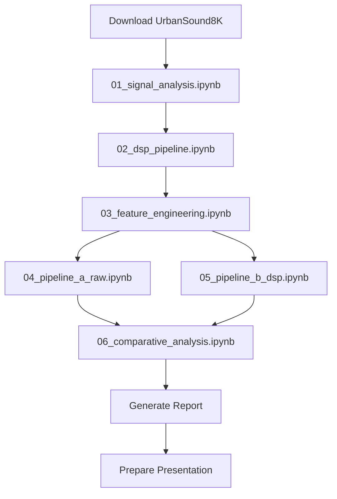

# Workflow Specification — DSP501

> Version: 1.0 | Last updated: 2026-03-13

## Experiment Pipeline Flow



## Per-Notebook Workflow

Each notebook follows:
1. Import dependencies + config
2. Load data
3. Process/analyze
4. Generate figures (auto-saved to `results/figures/`)
5. Save results (pickle to `results/`)
6. Print summary

## Cross-Validation Flow

```
For each fold k in 1..10:
    train_folds = all folds except k
    test_fold = k

    Load audio for train_folds → X_train, y_train
    Load audio for test_fold → X_test, y_test

    [Pipeline B only] Apply DSP preprocessing

    Extract features
    Train model (with grid search on train set)
    Predict on test set
    Compute metrics → store per-fold

Aggregate: mean ± 95% CI across 10 folds
Statistical test: paired t-test between Pipeline A and B fold scores
```

## Related Docs

- [ARCHITECTURE.md](ARCHITECTURE.md)
- [ROADMAP.md](ROADMAP.md)
- [MODEL_SPEC.md](MODEL_SPEC.md)
